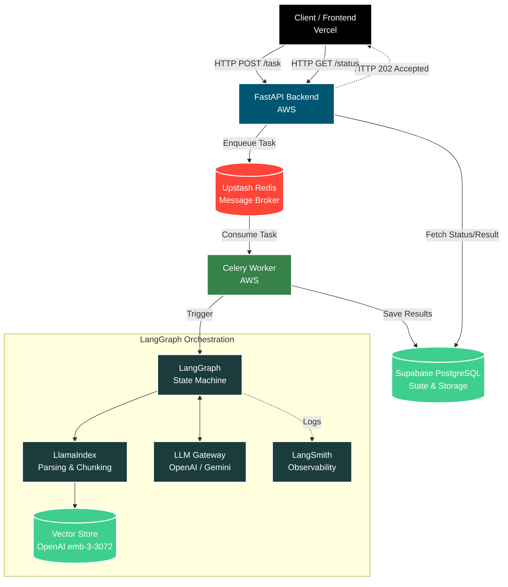
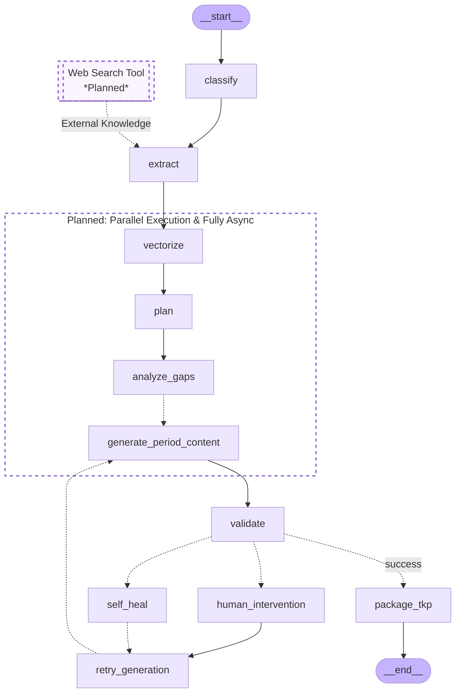

# GyanSetu - Teacher AI Platform 🎓🤖

**GyanSetu** is an intelligent, async-first "Teacher AI Platform" designed to automate and elevate educational content generation. Built by an AI Engineer for modern educators, the platform ingests raw educational materials and orchestrates a complex, stateful AI pipeline to output structured lesson plans, learning gap analyses, and validated educational content with fully multilingual support.

## 🚀 Live Deployment

* **Frontend (Vercel):** [https://gyan-setu-frontend-t6o1.vercel.app/](https://gyan-setu-frontend-t6o1.vercel.app/)
* **Backend API (AWS):** [http://18.206.168.179:8000/docs](http://18.206.168.179:8000/docs)
* **GitHub Frontend:** [GyanPrakashkushwaha/GyanSetu-Frontend](https://github.com/GyanPrakashkushwaha/GyanSetu-Frontend)
* **GitHub Backend:** [GyanPrakashkushwaha/GyanSetu](https://github.com/GyanPrakashkushwaha/GyanSetu)

*(Note: Live deployment may experience intermittent downtime during active updates).*

---

## 🏗 High-Level Architecture

The system utilizes an asynchronous, event-driven architecture to prevent API timeouts during long-running LangGraph workflows.



---

## ⚙️ The Agentic Pipeline Workflow

The core intelligence of GyanSetu is powered by a stateful **LangGraph** orchestrator that manages a strict, cyclical execution pipeline ensuring maximum content quality:

1. **`__start__` & `classify**`: Receives the uploaded document and performs initial categorization of the educational material.
2. **`extract`**: Utilizes LlamaIndex for intelligent PDF parsing and text chunking to extract key metadata, target audience, and core learning objectives across multiple languages.
3. **`vectorize`**: Converts extracted chunks into high-dimensional vector representations using OpenAI's `text-embedding-3-large` (3072 dimensions) for granular semantic search.
4. **`plan`**: Generates structured, timed lesson outlines based on the extracted objectives.
5. **`analyze_gaps`**: Agentic evaluation of the material to identify missing prerequisites or conceptual leaps.
6. **`generate_period_content`**: Expands the lesson plan into rich, engaging educational content.
7. **`validate` (LLM-as-a-Judge)**: A critical evaluation node where an independent LLM prompt evaluates the generated content against the original learning gaps and objectives.
8. **Conditional Routing (`self_heal` / `human_intervention`)**: If validation fails, the graph routes to self-healing logic or flags for human intervention.
9. **`retry_generation`**: Adjusts prompts and context based on feedback from the validation phase, cycling back to `generate_period_content`.
10. **`package_tkp` & `__end__**`: Upon a `success` signal from the validator, merges the content into a final, structured JSON format, saves to Supabase, and marks the task as complete.


---

## 🧠 Design Decisions, Trade-offs & Future Work

* **Async-First Infrastructure:** LLM generation chains take time. To prevent HTTP timeout errors, FastAPI immediately returns a task ID while a background Celery worker (backed by Upstash Redis) handles the LangGraph execution.
* **LlamaIndex over Standard Loaders:** Native document loaders often struggle with complex formatting. LlamaIndex was integrated specifically for its superior Document Intelligence, enabling seamless multilingual parsing and intelligent chunking.
* **LangGraph for Cyclical Flow:** A sequential chain cannot self-correct. LangGraph allows the `validate` node to route backward for a `retry_generation`, ensuring the final output meets pedagogic standards.

### 🚀 Future Enhancements (Roadmap)

Due to strict time constraints during the initial build, the following high-impact features are prioritized for the next iteration:

* **Extraction Web Search Tool:** Integrating an external search tool into the `extract` node to provide the LLM with up-to-date, external knowledge, aggressively reducing hallucination risks.
* **Parallel Execution:** Refactoring the `plan` and `generate_period_content` nodes to run period planning in parallel, significantly reducing total task execution time.
* **Enhanced Tracing:** Deepening the LangSmith integration for more granular tracing of the self-healing loops.
* **End-to-End Async:** Transitioning the entire generation pipeline to fully asynchronous LLM calls within the LangGraph nodes.

---

## 🌟 Bonus Highlights

* **Fully Multilingual:** The extraction and generation nodes support cross-language educational planning out of the box.
* **LLM-as-a-Judge:** Implements a rigorous self-reflecting validation layer to guarantee output quality without human-in-the-loop dependencies.
* **High-Fidelity Vectors:** Upgraded to `text-embedding-3-large` (3072 dimensions) for unparalleled retrieval accuracy.
* **Robust Observability:** Custom exception handling and LangSmith integration ensure every worker task is fully traceable.

---

## 💻 Local Setup & Installation

### Prerequisites

* Python 3.10+
* Docker & Docker Compose
* An Upstash Redis account & Supabase PostgreSQL database

### 1. Environment Variables

Create a `.env` file in the root directory:

```env
# AI Models & Orchestration
OPENAI_API_KEY=
GEMINI_API_KEY=
LLAMA_CLOUD_API_KEY=
TAVILY_API_KEY=

# LangSmith Observability
LANGCHAIN_TRACING_V2=true
LANGCHAIN_ENDPOINT=https://api.smith.langchain.com
LANGCHAIN_API_KEY=
LANGCHAIN_PROJECT=

# Infrastructure
REDIS_URL=
DATABASE_URL=
DB_CONNECTION_STRING=

```

### 2. Running via Docker

The application is fully containerized for seamless deployment.

```bash
docker build -t gyansetu .
docker run -p 8000:8000 --env-file .env gyansetu

```

### 3. Running Locally (Without Docker)

```bash
# Install dependencies
pip install -r requirements.txt

# Start Celery Worker
celery -A app.api.celery_app.celery_app worker --loglevel=info

# Start FastAPI Server
uvicorn app.main:app --reload --host 0.0.0.0 --port 8000

```

