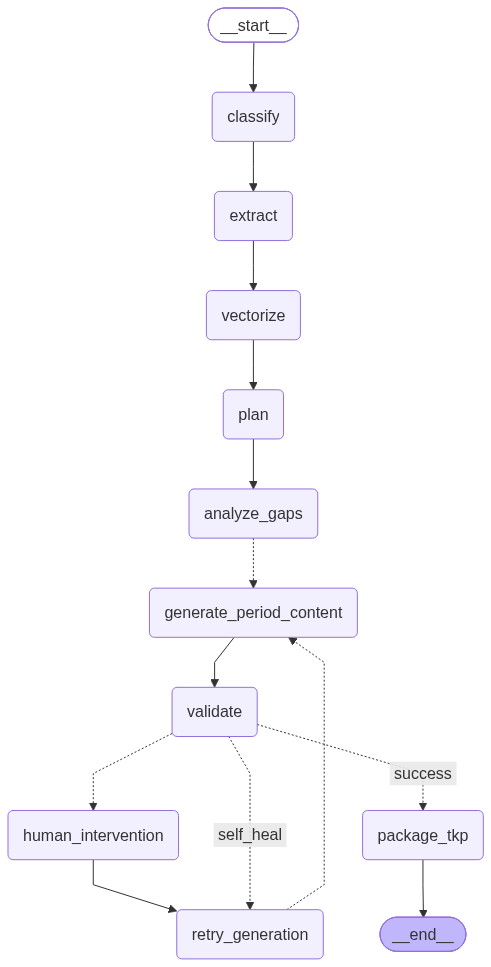

## Graph workflow-


```
gyansetu/
├── app/
│   ├── api/                      # Routing layer (No business logic here)
│   │   ├── dependencies.py       # FastAPI dependencies (auth, db sessions)
│   │   ├── celery_app.py         #  (backgroud process)
│   │   ├── routes.py             # routes
│   │   ├── schemas.py            # models used in fastapi app
│   ├── core/                     # Application-wide settings
│   │   ├── config.py             # Pydantic BaseSettings (Env vars)
│   │   ├── exceptions.py         # Custom error classes (e.g., ExtractionError, GenerationError)
│   │   ├── logger.py             # Observability/Logging setup
│   │   └── prompts.py            # Centralized system prompts (Avoid hardcoding in services)
│   ├── infrastructure/           # External I/O (The "Outer Ring" in Clean Arch)
│   │   ├── database.py           # PostgreSQL/SQLAlchemy setup
│   │   ├── vector_store.py       # Qdrant/Pinecone/ChromaDB interfaces
│   │   ├── llm_gateway.py        # Centralized LLM client (OpenAI/Anthropic) with retries
│   │   └── redis_client.py       # Celery/RQ queues or caching for progress streaming
│   ├── models/                   # Data layer
│   │   ├── domain.py             # SQLAlchemy models (Data at rest)
│   │   └── schemas.py            # Pydantic models (Data in motion - strict types)
│   ├── pipelines/                # Core Business Logic (The "Inner Ring")
│   │   ├── orchestrator.py       # LangGraph state machine / Main Multi-Agent orchestrator
│   │   ├── phase1_extraction/    # Stages 1-3
│   │   │   ├── parser.py         # Document parsing strategies (LlamaParse/PDFium)
│   │   │   └── extractor.py      # Metadata & Knowledge chunking/extraction
│   │   ├── phase2_generation/    # Stages 4-7
│   │   │   ├── planner.py        # Multi-period pedagogical strategy
│   │   │   └── generator.py      # Lesson content & Activity generation
│   │   └── phase3_validation/    # Stages 8-10
│   │       ├── validator.py      # Self-reflection / Output QA
│   │       └── packager.py       # Assembling the final Teacher Knowledge Package (TKP)
│   └── main.py                   # FastAPI application initialization
├── tests/                        # Systematic testing (Pytest)
│   ├── test_extraction.py
│   ├── test_generation.py
│   └── test_api.py
├── docker-compose.yml            # Services orchestration (App, Redis, DB)
├── Dockerfile                    # Containerization for the FastAPI app
└── requirements.txt              # Dependency management

```